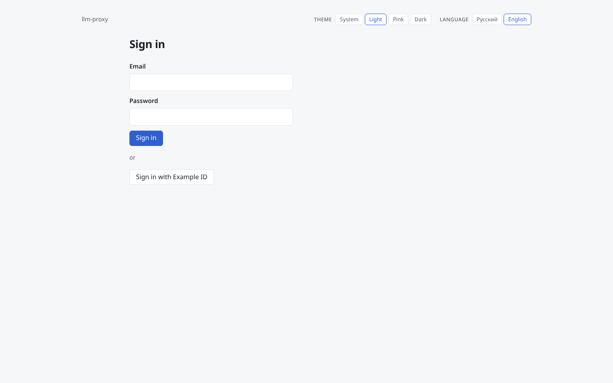
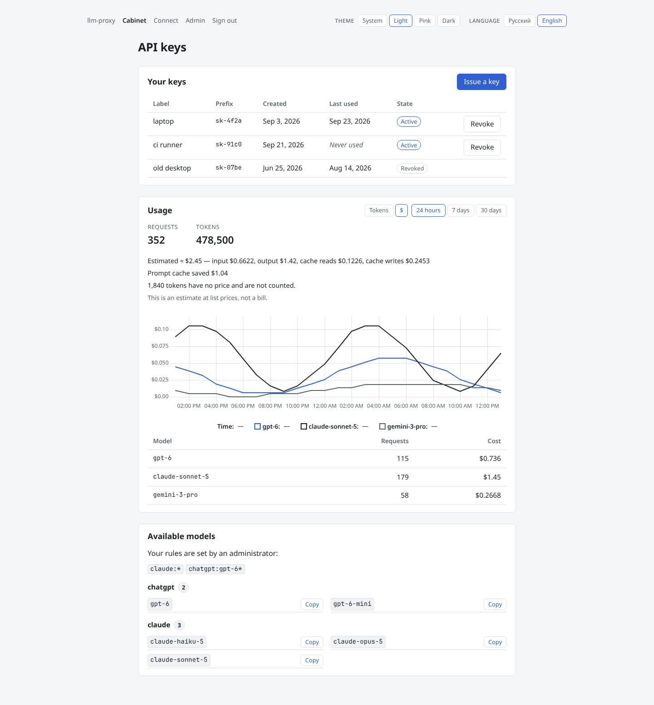
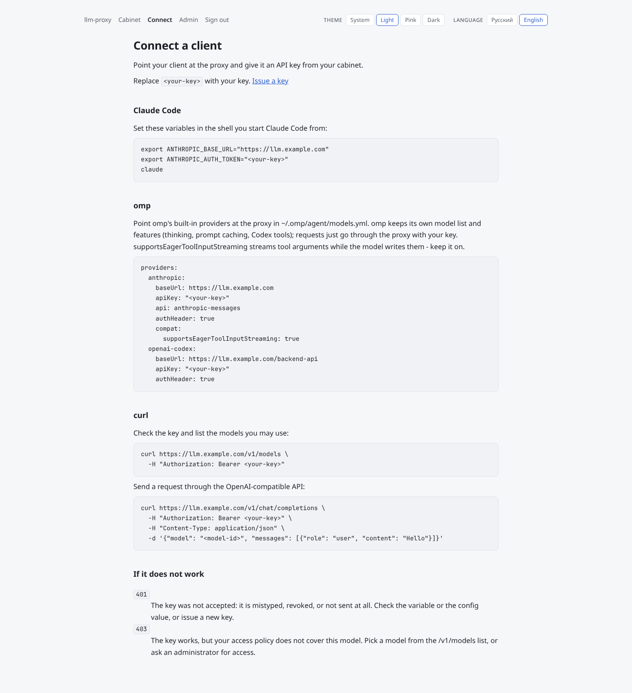
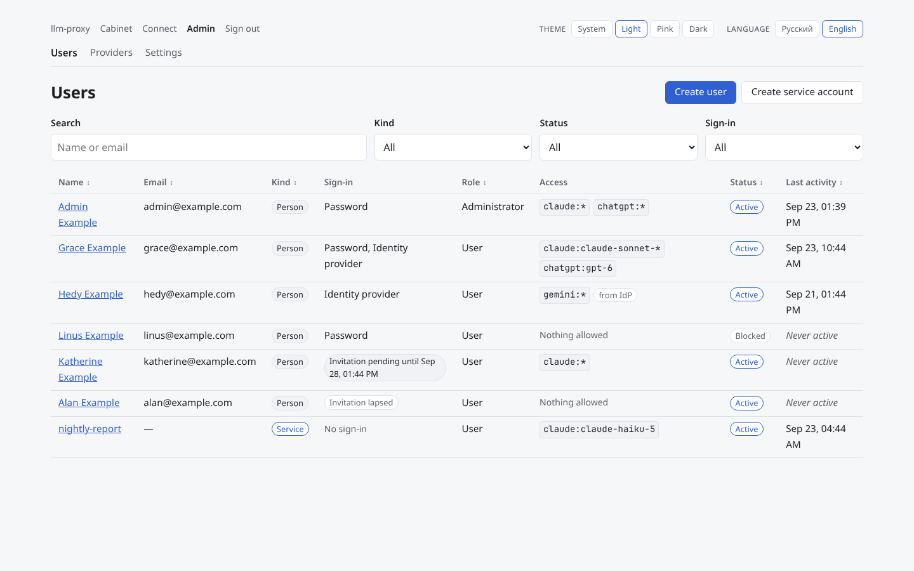
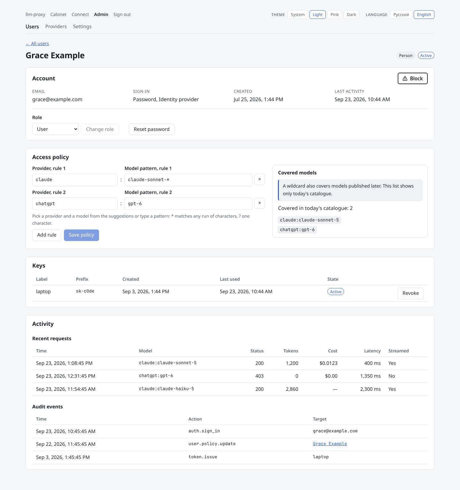
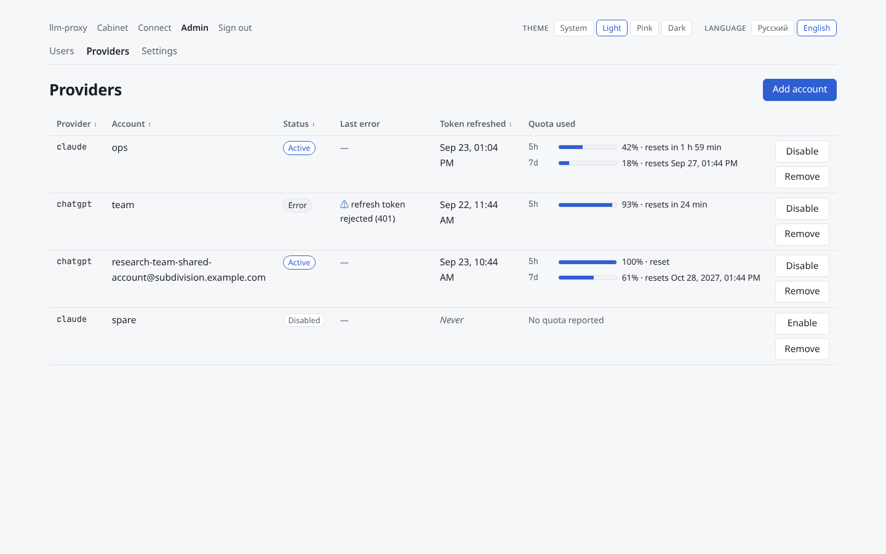
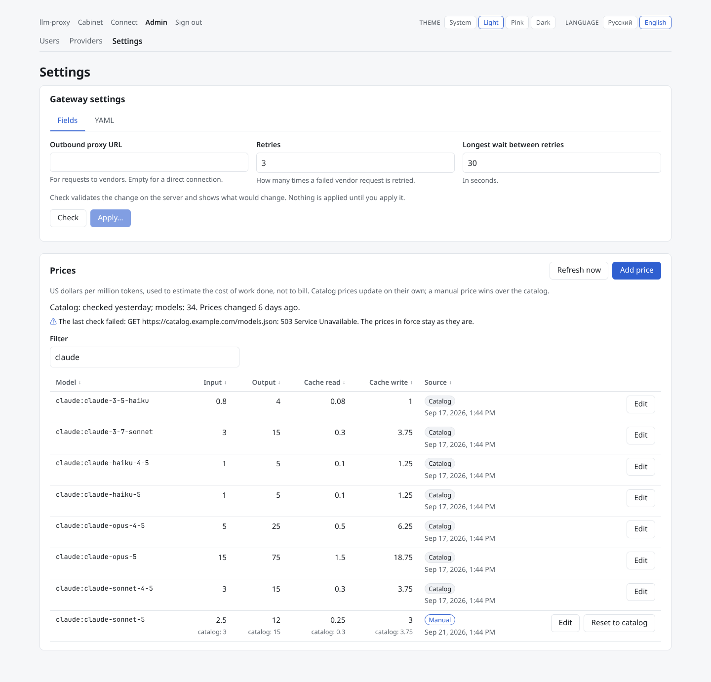
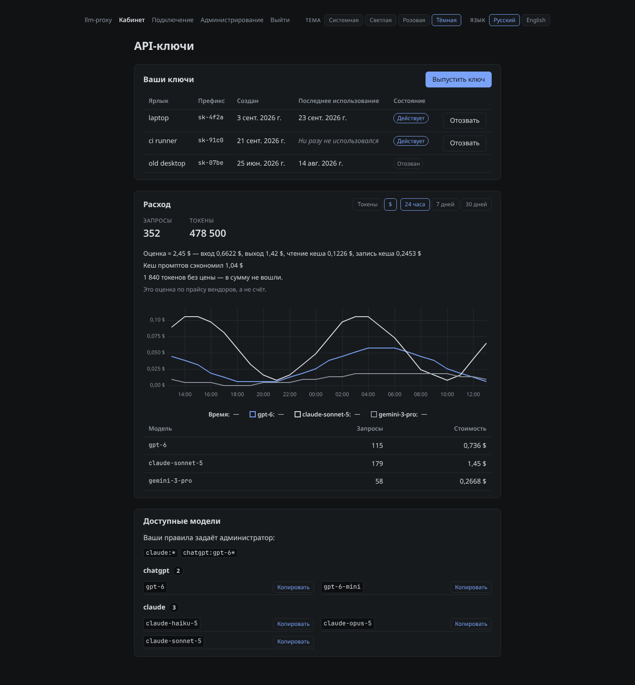

# llm-proxy frontend

> **llm-proxy is one system in two repositories:** [llm-proxy-backend](https://github.com/elleqt/llm-proxy-backend) — the gateway, web API and metrics (start here to run it) · [llm-proxy-frontend](https://github.com/elleqt/llm-proxy-frontend) — the web interface: cabinet and admin panel.

## What it is

This is the web interface of llm-proxy, a self-hosted gateway that lets a team share Claude and ChatGPT subscriptions through personal API keys. A plain CLIProxyAPI setup keeps keys and access in one config file that only one person can edit. llm-proxy moves that into a web interface: people issue and revoke their own keys and see their own spend, and administrators manage access per person and per model without editing files or restarting anything.

- **Cabinet** — sign in with a password or through your OIDC identity provider; issue and revoke API keys; usage over 24 hours, 7 or 30 days in tokens or in dollars, with the estimated cost split into input, output, cache reads and cache writes, and what the prompt cache saved; the models your access rules allow.
- **Connect** — ready-made configuration for Claude Code, omp and curl (OpenAI-compatible API), filled in with the gateway's address.
- **Admin panel** — users and service accounts with per-user access rules (`<provider>:<model-glob>`, e.g. `chatgpt:*`, `claude:claude-sonnet-*`) and a preview of the models they cover; each user's keys, recent requests with cost, and audit events; vendor accounts with their quota usage and a browser sign-in wizard for adding new ones; gateway settings (outbound proxy, retries) as fields or YAML with a server-side check before applying; the price list, kept up to date from a public model catalog, with manual overrides.
- English and Russian; four themes: system, light, pink, dark.

## Screenshots

All screenshots use the in-browser mock API (`VITE_MOCK_API=1`, see [Development](#development)); every name, address and number in them is made up.

| | |
|---|---|
| [](docs/screenshots/login.png)<br>Sign-in: password or the identity-provider button. | [](docs/screenshots/cabinet.png)<br>Cabinet: API keys, usage in dollars with the cost breakdown and cache savings, available models. |
| [](docs/screenshots/connect.png)<br>Connect: copy-paste configuration for Claude Code, omp and curl. | [](docs/screenshots/admin-users.png)<br>Admin, users: people and service accounts, sign-in methods, access rules, status. |
| [](docs/screenshots/admin-user.png)<br>Admin, one user: access rules with the models they cover, keys, recent requests with cost, audit events. | [](docs/screenshots/admin-providers.png)<br>Admin, providers: vendor accounts, errors, quota windows and when they reset. |
| [](docs/screenshots/admin-settings.png)<br>Admin, settings: gateway settings and the price list with the catalog status. | [](docs/screenshots/cabinet-dark-ru.png)<br>The cabinet in the dark theme, in Russian. |

## Running it

This repository is not run on its own. The whole system — Postgres, the backend and this frontend — starts from the docker compose file in the backend repository, which builds this repository from `../frontend`. Clone both repositories side by side and follow the backend's [Quick start](https://github.com/elleqt/llm-proxy-backend#quick-start):

```
llm-proxy/
├── backend/    # git clone https://github.com/elleqt/llm-proxy-backend backend
└── frontend/   # git clone https://github.com/elleqt/llm-proxy-frontend frontend
```

In that stack the web interface is published on port 8081 and the proxied LLM API on port 8080.

## Container image

The [`Dockerfile`](Dockerfile) builds the application with Node 22 and serves the static build with unprivileged nginx (alpine) on port 8080. Requests under `/api/` are proxied to the backend's web listener; every other path that is not a file is the single-page application (`index.html`).

Runtime environment variables:

| Variable | Default | Meaning |
|---|---|---|
| `BACKEND_ORIGIN` | `http://backend:8081` | `scheme://host[:port]` of the backend's web listener, no path. Resolved per request, so nginx starts before the backend exists and follows it across restarts. |
| `REAL_IP_FROM` | unset | Comma-separated addresses or CIDRs of the reverse proxies in front of this container. Their `X-Forwarded-For` is trusted, so the `X-Real-IP` sent to the backend (which it uses for rate limits and audit) is the client rather than the proxy. Unset: nothing is trusted. Entries that are not addresses or CIDRs stop the container from starting. |

The application is served at the site root; the base path is fixed at `/`. Mount it on its own host name (e.g. `llm.example.com`) or behind a proxy that strips a prefix.

What the image does besides serving files:

- **Content Security Policy** without `'unsafe-inline'`: `script-src 'self'` plus the SHA-256 hash of the one inline script — the pre-paint script that applies the saved theme and language before the first paint. The hash is computed at image build time from the built `index.html` ([`nginx/csp-hash.mjs`](nginx/csp-hash.mjs)), so it cannot drift from the script.
- **Security headers**: `X-Content-Type-Options: nosniff`, `Referrer-Policy: strict-origin-when-cross-origin`, `Cross-Origin-Opener-Policy: same-origin`, a restrictive `Permissions-Policy`, `frame-ancestors 'none'`, no `server_tokens`. No `Strict-Transport-Security`: the container speaks plain HTTP behind your TLS edge, and HSTS belongs there.
- **Caching**: hashed files under `/assets/` are immutable for a year; everything else is revalidated, so a deploy is picked up on the next load; `/api/` responses keep the backend's own headers.
- **`GET /healthz`**: `200 ok` when the build is in place, `503` otherwise; the image's `HEALTHCHECK` calls it.
- `/api/` requests are forwarded with `Host`, `X-Forwarded-For`, `X-Forwarded-Proto` and `X-Real-IP`, a 120 s read timeout (vendor sign-in completion can take about 90 s) and a 2 MiB body limit.

[`nginx/check-headers.sh`](nginx/check-headers.sh) checks the header contract against any running image (`nginx/check-headers.sh http://127.0.0.1:8080`); CI runs it on every push.

## Development

Requires Node.js 22.22 or newer (`engines` in `package.json`; CI and the image use Node 22).

```sh
npm ci
```

**Against a running backend.** `npm run dev` starts Vite's dev server (http://localhost:5173 by default) and proxies `/api` to `VITE_BACKEND_ORIGIN`, default `http://localhost:8081`. That default works for both usual setups: the compose stack, whose frontend container on 8081 forwards `/api` to the backend, and a backend run directly, whose web listener defaults to `127.0.0.1:8081`. Anything else goes in `.env.local`:

```sh
VITE_BACKEND_ORIGIN=http://backend.example.com:8081
```

**Without a backend.** An in-browser mock API ([MSW](https://mswjs.io/), [`src/mocks/browser.ts`](src/mocks/browser.ts)) answers `/api` with made-up data:

```sh
VITE_MOCK_API=1 npm run dev
```

Sign in as `admin@example.com` with the password `password` (any address works with that password; one that starts with `admin` gets the administrator role, any other a regular user). The mock is only imported in development, so no production build contains it.

**Checks and builds:**

| Command | What it does |
|---|---|
| `npm test` | Type-checks, then runs the unit and component tests (Vitest, jsdom). |
| `npm run build` | Type-checks and builds the static site into `dist/`. |
| `npm run preview` | Serves the built `dist/` locally. |
| `npm run e2e:stack` | End-to-end tests (Playwright) against the real system: builds and starts the backend's compose stack from `../backend` (override with `BACKEND_DIR`), waits until it is healthy, runs the tests and tears everything down, including volumes and built images. Needs Docker with compose v2, ports 8080 and 8081 free, and a browser: `npx playwright install chromium` or `E2E_CHROMIUM_PATH` pointing at a Chrome/Chromium binary. Extra arguments go to `playwright test`. |
| `npm run e2e` | Only the Playwright run, against a stack that is already up; the variables it needs are set by `scripts/e2e-stack.sh`. |

There is no separate lint or format script; `tsc` runs as part of `npm test` and `npm run build`. CI ([`.github/workflows/ci.yml`](.github/workflows/ci.yml)) runs the build, the tests, the generated-types check, and builds the image, waits for it to become healthy and checks its headers.

## API contract

[`api/openapi.yaml`](api/openapi.yaml) is the backend's contract, copied from the backend repository — the backend is its source of truth. To update it from a backend checkout next to this one (override with `BACKEND_DIR`):

```sh
npm run sync:contract   # scripts/sync-contract.sh: copies api/openapi.yaml, then runs gen:api
```

TypeScript types are generated from it with `npm run gen:api` into `src/shared/api/schema.d.ts`. Never edit the generated file; CI regenerates it and fails if it differs from what is committed.

## Project structure

The source follows feature-sliced layers; a layer imports only from the layers below it.

| Path | Contents |
|---|---|
| `src/app/` | Application shell: routes, session and admin guards, layout, query client, the pre-paint script. |
| `src/pages/` | One directory per screen: `login`, `password`, `cabinet`, `connect`, `admin` (`users`, `user`, `providers`, `settings`), `not-found`. |
| `src/features/` | User actions: `issue-token`, `revoke-token`, `policy-editor`, `provider-login` (vendor sign-in wizard), `preferences` (theme and language switches), `session` (sign-out), `no-model-access`. |
| `src/entities/` | Data from the API and its queries: `session`, `user`, `token`, `usage`, `connect`, `provider`, `settings`. |
| `src/shared/` | `api` (typed client and the generated schema), `i18n`, `ui` (components), `lib` (dates, money, preferences), `styles` (tokens, base). |
| `src/mocks/` | The development mock API. |
| `src/test/` | Test setup and helpers for Vitest. |
| `e2e/` | Playwright end-to-end tests. |
| `nginx/` | The nginx config template, the CSP hash step, the `REAL_IP_FROM` entrypoint step and the header check. |
| `scripts/` | `sync-contract.sh`, `e2e-stack.sh`. |
| `api/` | The vendored OpenAPI contract. |

## i18n and themes

The interface is in English and Russian. Messages live in [`src/shared/i18n/en.ts`](src/shared/i18n/en.ts) and [`ru.ts`](src/shared/i18n/ru.ts); `ru` is typed against the English keys, so a missing translation fails the type check. API errors are shown by error code from the dictionary, never as the server's text.

Themes: `auto` (follows the system), `light`, `pink` and `dark`, defined as CSS variables in [`src/shared/styles/tokens.css`](src/shared/styles/tokens.css). The chosen theme, language and usage-chart unit are the only things kept in `localStorage`. An inline pre-paint script (the one the CSP hash allows) puts the theme and language on `<html>` before the first paint, so there is no flash of the wrong theme.

## Related repository

[llm-proxy-backend](https://github.com/elleqt/llm-proxy-backend) — the gateway, web API, metrics and the docker compose file for the whole system. **Start there** to run llm-proxy.

## License

[MIT](LICENSE). The backend embeds [CLIProxyAPI](https://github.com/router-for-me/CLIProxyAPI) (MIT).

Using subscription accounts through a proxy is subject to each vendor's terms; the operator is responsible for compliance.
